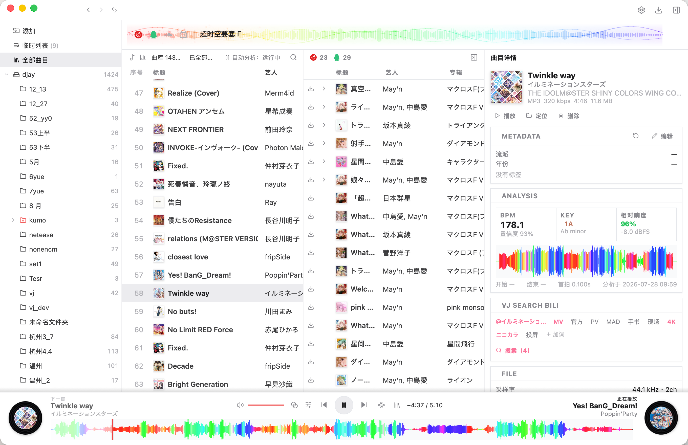

<div align="center">
  <p>
    
  </p>

  <h1>
    Kumo's<br>
    <em>Download &amp; Jockey</em>
  </h1>

  <p>
    
    <a href="https://github.com/kumoSleeping/KDJ/releases/latest"></a>
    
    
    
  </p>

  <br>

  
</div>

---

[中文](README.md) · **English**

## Get the app

Choose your platform below to open the latest [Releases](https://github.com/kumoSleeping/KDJ/releases/latest). Available for macOS, Windows, Linux, and Android.

<p>
  <a href="https://github.com/kumoSleeping/KDJ/releases/latest"></a>
  <a href="https://github.com/kumoSleeping/KDJ/releases/latest"></a>
  <a href="https://github.com/kumoSleeping/KDJ/releases/latest"></a>
  <a href="https://github.com/kumoSleeping/KDJ/releases/latest"></a>
</p>

You may need to allow apps from unidentified developers. On macOS, allow the app under System Settings → Privacy & Security → General.

When GitHub is reachable, KDJ checks for updates on launch. You can also check manually in Settings.

> [!NOTE]
> Everyday library management and music analysis do not require FFmpeg. Video remuxing, extracting audio from video, and VJ export need [FFmpeg](https://ffmpeg.org/download.html) installed on the system.

KDJ packs cross-platform search, download, local library management, and music analysis into one desktop app. Instead of jumping between websites, downloaders, and tagging tools, preparing music can stay one continuous workflow.

## Features

- Download
  - Cross-platform aggregate search
  - QR login and source priority ordering
  - Deduplicated merged results; track / playlist links and batch intake
  - In-app preview with quality fallback (FLAC / 320 / 128)
  - One-click playlist download and a configurable download queue
  - Explore: search Remix and VJ
- Library
  - Drag-first organization
  - Local library / folder scanning and tag editing
  - Sidebar virtual playlists that reference local tracks without duplicating audio
  - Desktop removable-drive discovery and portable OneLibrary + M3U8 export
  - Camelot wheel with BPM / energy filters
  - Automatic BPM, key, Camelot / Open Key, loudness, and energy analysis
  - Harmonic similarity recommendations (library / folder / temporary queue)
  - Waveform in/out points, star ratings, and cover art
  - Automatic VJ export (requires [FFmpeg](https://ffmpeg.org/download.html))

> [!NOTE]
> Portable OneLibrary export copies the audio files to the drive; a playlist that only references files on the current computer cannot work elsewhere. Tracks with complete KDJ analysis also export BPM, key, beatgrid, and OneLibrary waveform data. The target DJ app fills in tracks that are still missing analysis. KDJ keeps a portable waveform cache under `.kdj` on the drive so remounting the virtual disk does not decode the same tracks again.
- Playback
  - System-level audio output and volume control
  - rkb-style waveform preview
  - Multiple transition effects (crossfade / bass swap / filter / FX)
  - Video floating window and system picture-in-picture; remux and audio extract
  - VJ export (video mix + audio mix)
  - Lyrics indexing and system-level desktop lyrics overlay
- Other
  - Light / dark / system theme; carefully designed interaction
  - Lightweight Tauri desktop app; Android supported
  - Automatic update checks on launch


## Build for development

Requires Node.js 20+, Rust 1.88+, and the matching [Tauri 2 prerequisites](https://v2.tauri.app/start/prerequisites/).

```bash
git clone https://github.com/kumoSleeping/KDJ.git
cd KDJ
npm install
npm run dev
```

Common commands:

```bash
npm run typecheck        # frontend typecheck
npm run tauri:web:build # build frontend
npm run build            # package the desktop app
```

KDJ uses React 19 for the UI, Rust for library, analysis, download, and playback, and Tauri 2 for the native desktop shell.

## Usage

KDJ provides media management and technical tools only. When using search, preview, and download features, follow local laws, platform terms, and copyright requirements.

## License

KDJ is released under the [MIT](https://opensource.org/license/mit) license.
