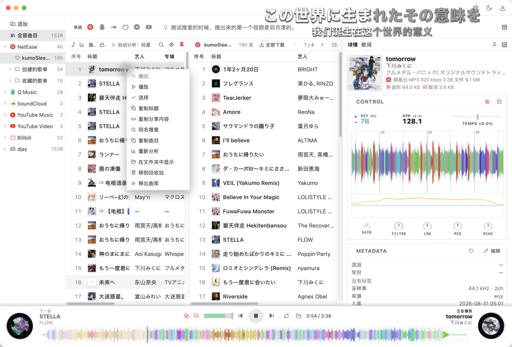

  

    
  

  <h1>
    Kumo's 
    <em>Download &amp; Jockey</em>
  </h1>

  

    
    
    
    
    
  

   

  

---

**中文** · [English](README.en.md)

KDJ 是一款面向音乐收集、整理、分析和播放的跨平台应用。它将多个音乐平台的搜索、试听、缓存与格式转换，以及本地曲库、BPM / 调性分析、波形、歌词和播放控制整合在同一个工作区，让准备音乐成为一条连续的工作流。

## 下载 & 安装 & 更新

按系统选择下方入口获取最新版安装包。macOS 按钮默认下载 Apple Silicon（M 系列）版本；Intel Mac 请在最新 [Releases](https://github.com/kumoSleeping/KDJ/releases/latest) 中选择 x64 DMG。

<!-- release-package-size-badges:start -->

  
  
  
  
  

<!-- release-package-size-badges:end -->

安装时可能需要在系统中允许安装来自未知来源的应用。macOS 可在“系统设置 → 隐私与安全性”中允许打开。

当软件所在环境可以联通 GitHub 时，KDJ 会在启动时自动检查更新。也可以在“设置”中手动检查。

> [!NOTE]
> 常规曲库管理、音乐分析和音频播放不依赖 FFmpeg；视频音画合并、视频音轨提取及部分格式处理需要系统已安装 [FFmpeg](https://ffmpeg.org/download.html)。

## 核心功能

### 搜索与下载

- 聚合搜索网易云音乐、QQ 音乐、SoundCloud、YouTube Music、YouTube 和哔哩哔哩等来源。
- 支持扫码登录、来源优先级、结果合并去重，以及单曲、歌单和合集链接解析。
- 支持在线试听与音质自动降级，并可从播放器直接下载当前在线歌曲。
- 歌单、专辑、艺人和电台结果提供独立详情页面，可翻页浏览或整页下载。
- 下载队列支持批量开始、失败重试、状态清理，以及在下载前调整音质或视频清晰度。
- 歌曲可按链接、基础信息或完整信息分享，也可在支持的平台上拖出文件或分享链接。
- Explore 可组合关键词搜索 Remix、Mashup、MV 和 VJ 素材。

### 曲库与音乐分析

- 支持本地文件夹扫描、标签编辑、星级评分、封面管理和不重复复制文件的虚拟播放列表。
- 自动分析 BPM、调性、Camelot / Open Key、响度和能量，并支持手动修正 BPM。
- 自动分析提供轻量、完整和暂停三种模式，播放时会优先保证音频流畅。
- 支持按 BPM、能量和 Camelot 调性筛选，并从全库、文件夹或临时列表中寻找和声相近的歌曲。
- 高精度波形能够呈现歌曲强弱、鼓点与频段变化，在线歌曲也可随播放逐步生成波形。
- 曲目详情可查看媒体、波形、歌词和分析数据的缓存状态，设置中可按类别统一管理缓存。

### 播放与控制

- 本地歌曲和在线歌曲使用统一的播放流程，并支持可开关的自动换曲与多种切歌效果。
- 当前曲目详情提供 Tempo、调性、增益、滤波器和三段均衡控制。
- 控制面板提供实时频谱和滚动波形，曲目详情可固定显示或自动跟随播放。
- 播放栏提供音量峰值与削波提示，时间可切换为已播放或剩余时间。
- 方向键可自定义为进度跳转、上下曲切换、列表选择或音量调整。
- 在线队列结束后，可按照 BPM 与调性从本地曲库继续选择适合衔接的歌曲。
- 支持视频预览和可调整的浮动小窗，macOS 还可预览允许公开嵌入的 YouTube 视频。

### 歌词与平台体验

- 支持普通歌词与网易云 YRC 逐字歌词，并可同时显示翻译和罗马音。
- 当前歌曲和下一首歌曲的歌词会提前获取并缓存，间奏期间不会停留显示上一句歌词。
- 桌面歌词与 Android 歌词浮窗共享逐字进度，并提供外观与显示方式设置。
- 提供浅色、深色和跟随系统主题，并可从顶部快捷切换日间与夜间外观。
- macOS 和 Windows 可在设置中安装 KDJ 命令行工具，并复制供 AI 操作 KDJ 使用的提示词。
- KDJ 基于 Rust 与 Tauri 构建，支持 macOS、Windows、Linux 和 Android，并可在启动时自动检查更新。

## 使用说明

KDJ 只提供媒体管理与技术工具。使用搜索、试听和下载功能时，请遵守所在地区的法律法规、内容平台条款及版权要求。

## 许可证

KDJ 以 [GNU GPL 3.0 或更高版本](LICENSE)发布。发行包静态链接 GPL-2.0-or-later
的 Rubber Band Library；对应源码和许可文本保存在
[`crates/kdj-player/vendor/rubberband`](crates/kdj-player/vendor/rubberband)，其他说明见
[`THIRD_PARTY_NOTICES.md`](THIRD_PARTY_NOTICES.md)。
